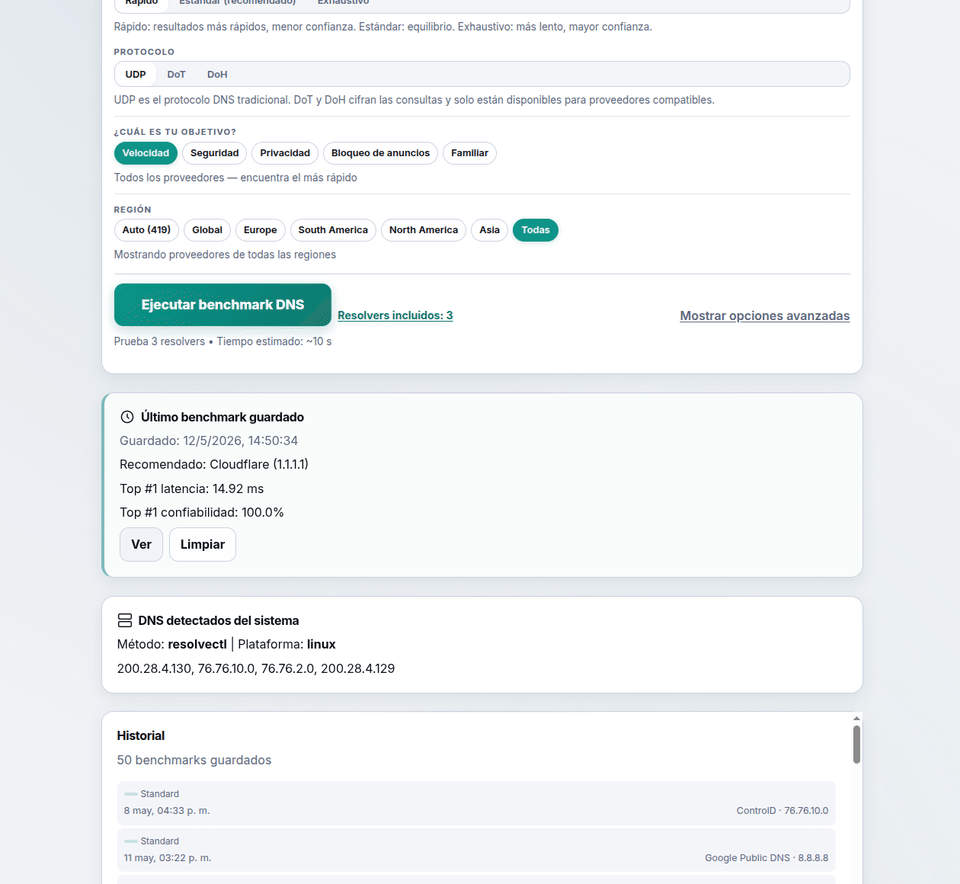
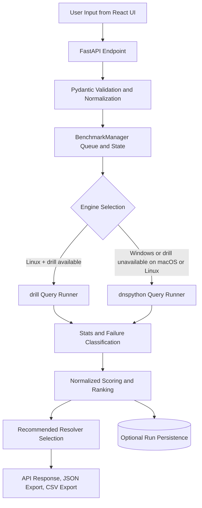

# DNSpect
Deterministic, local-first DNS resolver benchmarking with FastAPI + React.

[](https://github.com/cortega26/DNSpect/actions/workflows/ci.yml)
[](https://github.com/cortega26/DNSpect/actions/workflows/release.yml)
[](https://github.com/cortega26/DNSpect/releases)
[](LICENSE)
[](backend/pyproject.toml)
[](.github/workflows/ci.yml)
[-f59e0b)](.github/workflows/ci.yml)
[-14b8a6)](.github/workflows/ci.yml)
[](.github/workflows/ci.yml)
[](.github/workflows/ci.yml)
[](.github/workflows/release.yml)
[](https://github.com/cortega26/DNSpect/commits/main/)



## Problem Statement
Most "DNS speed test" pages run from a remote browser context or cloud vantage point, so they measure someone else's network path. DNSpect runs on your machine, sends real DNS queries to candidate resolvers, and ranks outcomes using latency, failure rate, and stability metrics.

## Features
### Core features
- Local DNS benchmark API (`FastAPI`) and web UI (`React + Vite + TypeScript`).
- Resolver benchmarking with per-run query samples and progress reporting.
- Engine selection:
  - `drill` on Linux when available.
  - `dnspython` fallback (including Windows).
- Ranking metrics per resolver:
  - `avg`, `median`, `p95`, `min`, `max`, timeout/failure rates, consistency ratio.
- Deterministic ranking output and recommended resolver selection.
- CSV and JSON export endpoints.
- System DNS detection on Linux/macOS/Windows.

### Advanced features
- Guided "apply DNS" modal with platform-aware instructions and verification probe.
- Live ranking panel during benchmark execution with motion budget controls.
- Optional sample inclusion (`include_samples=1`) for deep diagnostics.
- Last-run persistence in browser storage with schema/version invalidation.
- Runtime queue controls for concurrency and queued jobs via environment variables.

### Reliability guarantees
- Queue pressure protection: benchmark start is rejected when `running + queued` exceeds configured capacity.
- Terminal state retention is bounded by TTL and max retained states.
- Persistence failure is non-fatal: benchmark completes and exposes `run_storage_warning`.
- Progress timestamps are monotonic (`last_sample_at` does not move backwards).
- Ranking and recommendation determinism are test-gated against input-order variance.

### Performance optimizations
- Background execution via `ThreadPoolExecutor`.
- Query schedule precomputed per run to avoid repeated scheduling overhead.
- Sample-heavy payloads excluded by default (`samples: []` + `sample_count`) unless explicitly requested.
- Frontend chart rendering supports Top-N limiting for readability/perf.
- Live ranking animation is automatically reduced/disabled for large row counts or reduced-motion users.

### Platform compatibility
- Release binaries generated for:
  - Linux x64
  - Windows x64
  - macOS x64
  - macOS arm64
- Development scripts for Linux/macOS (`scripts/dev.sh`) and Windows (`scripts/dev.ps1`).
- DNS detection methods:
  - Linux: `resolvectl` then `/etc/resolv.conf`
  - macOS: `scutil --dns`, fallback `networksetup`
  - Windows: `ipconfig /all`, fallback `netsh`

### Privacy considerations
- Local-first execution: no telemetry or analytics pipeline in this repo.
- Network egress is DNS query traffic to selected resolvers only.
- Benchmark metadata is persisted under a platform user data path resolved by `platformdirs` (`user_data_path("dnspect", "DNSpect") / "runs"`); sample persistence is disabled by default unless `DNS_SPEED_LAB_PERSIST_SAMPLES=1`.
- UI stores "last run" in browser local storage for convenience.

## Security Model
### Attack surface
- Inbound surface: local HTTP server (`uvicorn`) on `127.0.0.1:8000` by default.
- Browser/API surface: endpoints under `/api/*` for benchmark/probe/export.
- Browser-origin policy surface: CORS is restricted to localhost/127.0.0.1 origins (including localhost regex ports).
- Outbound surface: DNS queries to configured resolver IPs; local OS command execution for DNS detection (`resolvectl`, `scutil`, `networksetup`, `ipconfig`, `netsh`) and optional `drill`.

### Input validation model
- Resolver input must be literal IP addresses (IPv4/IPv6); invalid values fail validation.
- Domain input must match strict hostname regex and is normalized/lowercased.
- Hard limits exist for workload control:
  - Benchmark: `runs 1..300`, `timeout_sec 0.1..10`, max 256 resolvers/queries.
  - Probe: max 8 resolvers, 32 queries, `runs_per_resolver 1..5`, `timeout_sec 0.1..5`.

### SSRF protections and applicability
- Traditional HTTP SSRF is not applicable by design because the backend does not fetch arbitrary URLs.
- Resolver targets are constrained to validated IP literals; domain names are query payloads, not network destinations.
- DNS queries can still reach private/internal IP resolvers if the local operator provides them. This is expected behavior for local diagnostics.

### Deterministic behavior guarantees
- Stable scoring and ranking keys are applied before response/export.
- Tie-breaking includes resolver identity for stable order.
- Tests explicitly verify ranking/recommendation invariance when resolver input order changes.

### Sandboxing, throttling, and validation layers
- Validation layer: `pydantic` request models + normalization/deduplication.
- Throttling layer: bounded worker pool plus queue limits.
  - `DNS_SPEED_LAB_MAX_CONCURRENT_JOBS`
  - `DNS_SPEED_LAB_MAX_QUEUED_JOBS`
- No OS sandboxing/isolation layer is implemented; process runs with current user privileges.
- Subprocess calls avoid `shell=True`, reducing command injection surface.

### Explicit trust boundaries
- Boundary 1: Browser/UI input is untrusted until backend validation.
- Boundary 2: Backend process is trusted code, but depends on local OS/network state and resolver responses (untrusted external systems).
- Boundary 3: If host binding is changed from localhost to a network-accessible interface, threat model changes materially (auth/TLS are not built in).

## Architecture Overview


Detailed design notes: `docs/ARCHITECTURE.md`.
Architecture deep dive: [docs/ARCHITECTURE.md](docs/ARCHITECTURE.md). <!-- TODO: replace with GitHub Pages URL once enabled -->

## Installation
### Option A: Run from source (dev)
Prerequisites:
- Python `>=3.11`
- Node.js `22.14.0` (CI pin)

Linux/macOS:
```bash
bash scripts/dev.sh
```

Windows (PowerShell):
```powershell
.\scripts\dev.ps1
```

### Option B: Use release binary
1. Download platform asset from GitHub Releases.
2. Run binary.
3. Open `http://127.0.0.1:8000`.

Release verification guide: `docs/RELEASE_VERIFY.md`.

## Usage Examples
### Start benchmark via UI
- Open app.
- Choose resolvers and mode (`quick`, `standard`, `exhaustive`).
- Start benchmark and watch live ranking.
- Export CSV/JSON when done.

### Start benchmark via API
```bash
curl -sS -X POST http://127.0.0.1:8000/api/benchmarks \
  -H 'Content-Type: application/json' \
  -d '{
    "mode": "standard",
    "runs": 30,
    "timeout_sec": 2,
    "resolvers": ["1.1.1.1", "8.8.8.8"],
    "queries": ["cloudflare.com", "google.com"]
  }'
```

Poll status:
```bash
curl -sS http://127.0.0.1:8000/api/benchmarks/<benchmark_id>
```

Export:
```bash
curl -sS -o dnspect.csv http://127.0.0.1:8000/api/benchmarks/<benchmark_id>/export.csv
curl -sS -o dnspect.json "http://127.0.0.1:8000/api/benchmarks/<benchmark_id>/export.json?include_samples=1"
```

### Run local quality gates
```bash
make backend-check
make backend-semgrep
cd frontend && npm run lint && npm run typecheck && npm test && npm run build
```

## Why This App Is Better Than Typical Online DNS Checkers
| Dimension | Typical online checker | DNSpect |
|---|---|---|
| Measurement vantage point | Remote browser/cloud path | Your machine and network path |
| DNS execution model | Often indirect/proxy-based checks | Real DNS lookups via `drill`/`dnspython` |
| Determinism | May vary with server-side cohort/load | Deterministic ranking/scoring path with stable tie-breaks |
| Input controls | Limited resolver/query control | Explicit resolvers, query list, run count, timeout, mode |
| Privacy | Traffic and metadata often leave local environment | Local-first operation; no telemetry codepath |
| Reliability signaling | Usually simple latency-only ranking | Latency + failure + stability + reliability guardrail |
| Validation guarantees | Usually undocumented | Enforced request validation and hard workload bounds |

## Roadmap

- [ ] Scheduled/recurring benchmarks with persistent history
- [ ] Configurable alerting when a resolver degrades beyond threshold
- [ ] CLI-only mode (headless, no UI dependency)

## Contributing
- Start here: `CONTRIBUTING.md`
- Security reporting: `SECURITY.md`
- Provider dataset notes: `docs/PROVIDERS.md`

## License
MIT. See `LICENSE`.
