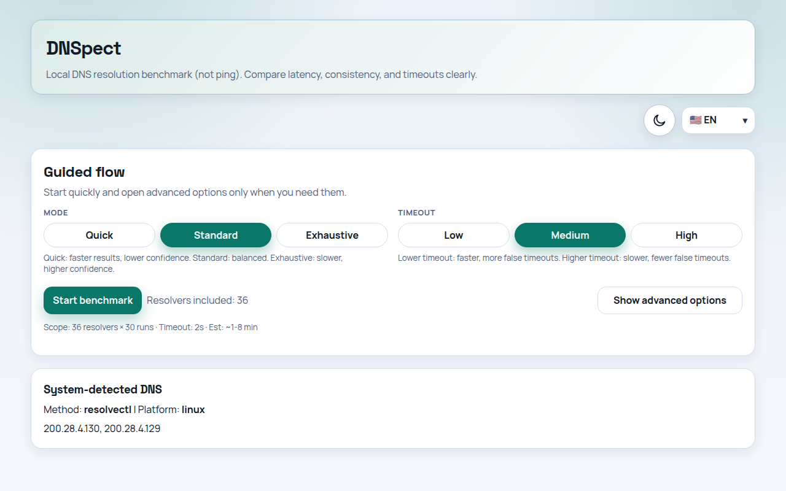
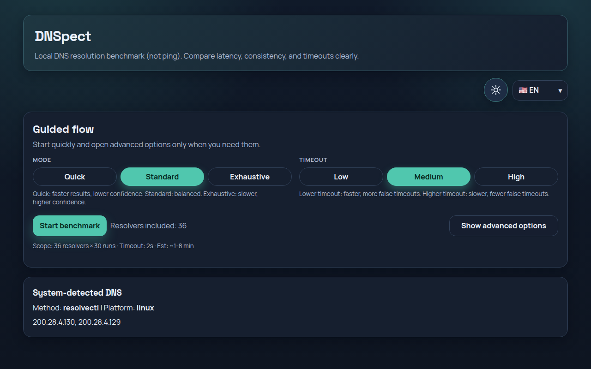
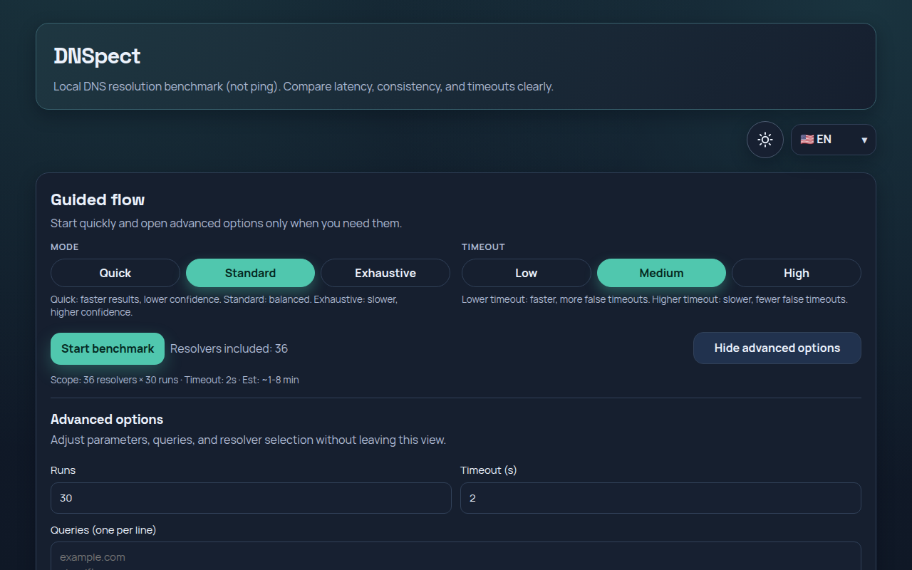
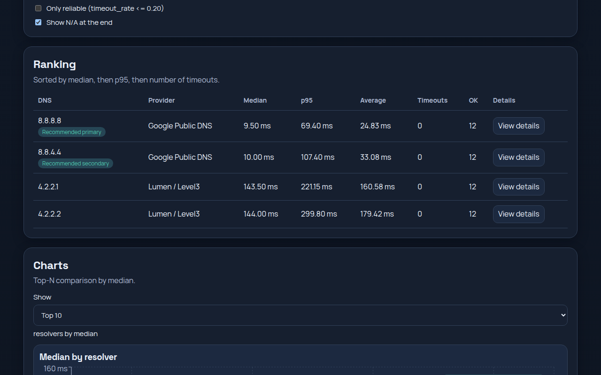

# DNS Benchmark Frontend

A fast, accessible DNS benchmarking interface that helps you choose the most reliable resolvers for your network.

## Badges




## Features

- Fast DNS resolver benchmarking
- Intelligent recommendation engine
- Multi-language support (ES/EN/PT)
- Accessibility-first UI
- Reduced motion support
- Deterministic layout
- Export support
- Keyboard navigable interface



## How it works

You select DNS resolvers and benchmark intensity, run a guided test, and review ranked results based on latency, timeout behavior, and reliability. The interface then highlights recommended primary and secondary resolvers and provides export options for reporting or further analysis.



## Getting started

Node `24.x` is required (engine-pinned). Install from the lockfile:

```bash
npm ci
npm run dev

npm run build
npm run preview
```

## Project structure

- `src/components`: UI building blocks for controls, results, charts, and detail views.
- `src/lib`: Shared app logic including API client, typing, ranking utilities, theme, and i18n.
- `src/hooks`: Lifecycle ownership hooks (benchmark session, run history, guided verification).
- `src/styles.css`: Global styles, layout rules, responsive behavior, and motion/accessibility preferences.
- `tests/e2e`: Deterministic Chromium regression suite (see `TESTING.md`).

## Accessibility

- Keyboard navigation
- Focus visibility
- Reduced motion support
- Semantic controls

## Internationalization

Supported languages:

- Spanish (ES)
- English (EN)
- Portuguese (PT)

## Development

```bash
npm run lint
npm run typecheck
npm run test
npm run build
```

## Screenshots



## License

MIT
